# Implementation Handoff — Intended Occupancy, Confidence Flip & AI Report Release

**Date:** August 17, 2026
**Author:** Zarlish Khan
**Trello board:** [True Occupancy](https://trello.com/b/U1EtLHku/true-occupancy) — cards #32 + #34–#52 (20)
**Reference implementation:** this repo, `app.html` — commits **`dc0f0af`** (confidence flip, Not-sure config, AI toggle, red-list retirement) and **`d68861c`** (Intended-occupancy columns, W1+W2) on `main`; #32's fix is the earlier `49f95f0`. Every card carries a screenshot of the implemented screen; the same images are embedded below and live in [`ticket-screenshots/`](../ticket-screenshots/).

---

## Repository, branch & push status

- **Repo:** `github.com/haniajamshaid-carbonteq/true-occupancy` · **Branch:** `main`
- **Push status (as of Aug 17):** all commits below are **pushed to `origin/main`** (HEAD `f38febf`). The GitHub commit links resolve. Clone `main` to get the full prototype.
- **Session commits, newest first:**
  - `8a58e6a` — docs(screenshots): Not-sure hero re-shoot (reconciliation headline)
  - `7495125` — fix: Not-sure hero keeps the reconciliation headline (#40)
  - `fa57634` — fix: Not sure remains Not sure everywhere — resolve choice drives colours only (#40–#42)
  - `72bf6a7` — docs(screenshots): regen #40/#42 (toggle design + Confidence/Rental Confidence)
  - `c0ca409` — feat: neutral result why-line for Not-sure (#40)
  - `c38aabf` — feat: "Rental Confidence" (raw) for Not-sure + toggle OFF (#40/#41)
  - `157ea16` — docs: scrub stale #45 (per-lender removed) references
  - `dd679a2` — feat: "Not sure" resolves to a chosen occupancy type — toggle + selector (#42)
  - `b842741` — docs(screenshots): regen AI report config — toggle only (#45 removed)
  - `8dbf53e` — feat: remove the per-lender "matched listing" trigger (#45)
  - `6244459` — feat: revert Not-sure resemblance layer (#42); label hero metric "Confidence" (#40)
  - `6eb19d0` — docs(screenshots): unsaved-changes banner for #32
  - `bca6044` — docs(handoff): mark #45/#49/#50 implemented
  - `1b3f477` — feat: AI-report trigger config, schedule-run AI status, list AI marker (#45, #49, #50)
  - `872ac70` — docs(handoff): mark W1/W2 implemented
  - `d68861c` — feat: Intended-occupancy columns across every surface (#34–#39, #48)
  - `009150e` — docs(handoff): screenshots + #32 + commit references
  - `dc0f0af` — feat: confidence flip, AI-report toggle, matrix-derived red (#40, #46, #51) — *Not-sure config from here later reverted by `6244459`*
  - `49f95f0` — fix(config): unsaved-changes banner copy (#32) — *already on the remote (pre-session)*
- Each card's **COMMIT** line names the specific commit its prototype lives in; find it at `github.com/haniajamshaid-carbonteq/true-occupancy/commit/<hash>` once pushed.

## How to use this document

Same contract as the [Aug-10 reconciliation handoff](handoff-2026-08-10-reconciliation.md): the Trello cards are per-screen because that is how QA verifies; this doc regroups them into **workstreams by shared code** so the derivation is written once, not six times. A card is done when every workstream listed against it has landed. **The prototype is the spec** — where copy or fallback behaviour is ambiguous, read `app.html` before inventing an answer.

Grounding: the [July-23 scope note](../TrueOccupancy-Scope-2026-07-23.pdf notes in one-pager) fixed the AI-report scope (batch, run-now, auto-run-on-red, provenance; the per-lender trigger was later dropped). The Aug-13 meeting fixed the declared-occupancy column. Anything beyond those is explicitly *not* in this release (see "Not in this release").

---

## Read this first: three decisions block work

1. ~~Where does per-lender AI-trigger config live? (#45)~~ — **resolved: the per-lender trigger was removed** (#45 is now that removal, `8dbf53e`).
2. **`InfoHover` tooltip extension** — the registered `Tooltip` is truncation-gated; the "Mixed" hover (#34/#36) and the AI marker hover (#50) need a general hover tooltip. (#42's tooltip was removed with the resemblance layer, so it no longer drives this.) The prototype now uses a native `title` for the "Mixed"/AI hovers; a candidate `InfoHover` from an earlier revision (grey bubble: `surface-2`/`ink-2`/`line` tokens) can be revived for production, pending design-system sign-off.
3. **Naming: "Deep Search" vs "Occupancy report"** (#43) — the action vs the artifact. Note `OccDepth` (`standard`/`deep-ambiguous`/`deep-always`) already exists as a *scan-depth* config; do not let the feature name collide with it.

---

## The two ideas underneath everything

**1 · Declared is derived through one resolver, like detected is.** The detected side already has one helper every screen calls (`occMatchForRisk`). This release gives the declared side the same: `resolveIntent(row, defaultIntent)` → `row.intent ?? defaultIntent`, plus a batch summary (uniform → the label; differing → `Mixed` + per-intent counts). Nine surfaces render it; none reimplement it.

**2 · The confidence % always describes the finding.** Stored score = P(rented). Finding **rented** → show raw; **not rented** → show `100 − score`; **possibly rented** → no flip (it *is* the uncertainty). Declared intent never changes the flip — it only drives the reconciliation headline. Same rule on screen and PDF; they must never disagree.

---

## Workstreams

### W1 — Declared-occupancy resolver *(land first)* · **✅ implemented (`d68861c`)**
**Closes:** #34 · **Prerequisite for:** W2
`resolveIntent` / `summarizeBatchIntent` / `batchIntentBreakdown` in `AppState.tsx`. Edge contract: undeclared → "Not sure", never blank; failed/unscanned rows still count toward the declared summary; historical batches resolve (per-row `intent` is retained on `BatchHistoryEntry.rows`).

### W2 — Intended columns across the surfaces · **✅ implemented (`d68861c`)**
**Closes:** #35 #36 #37 #38 #39 #48 · **Depends on:** W1

**Implemented state (port these):**

*Dashboard → Recent Scans — Intended beside Verdict:*
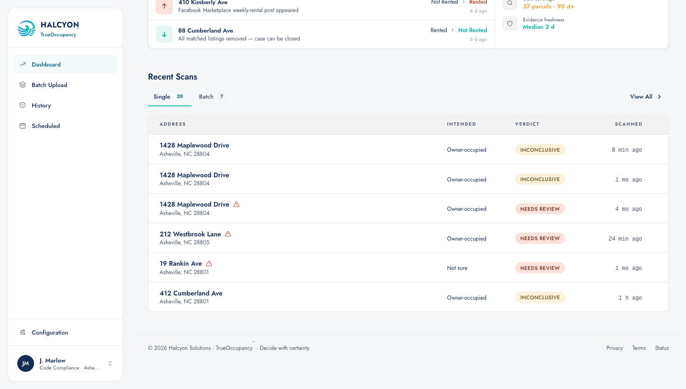

*History list — Address · Intended · Verdict (same shared builder pattern as Dashboard):*
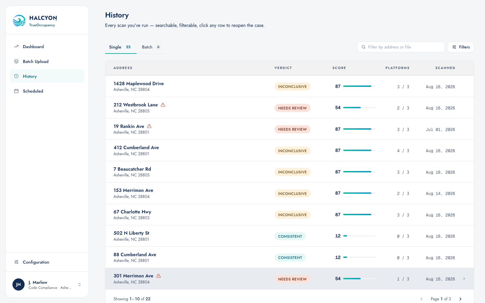

*Batch results — per-address Declared in the default view (Permit Sweep seed shows an override → the batch reads "Mixed" in lists):*
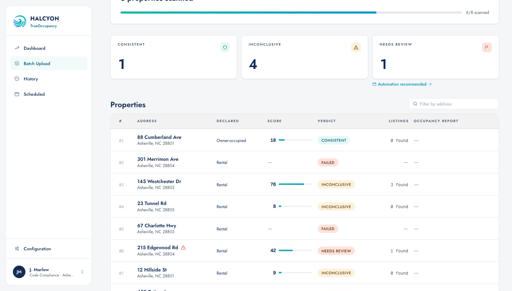

*Scheduled list (single via originating run; batch = summary/"Mixed" with hover breakdown) and batch-schedule detail (summary RuleField):*
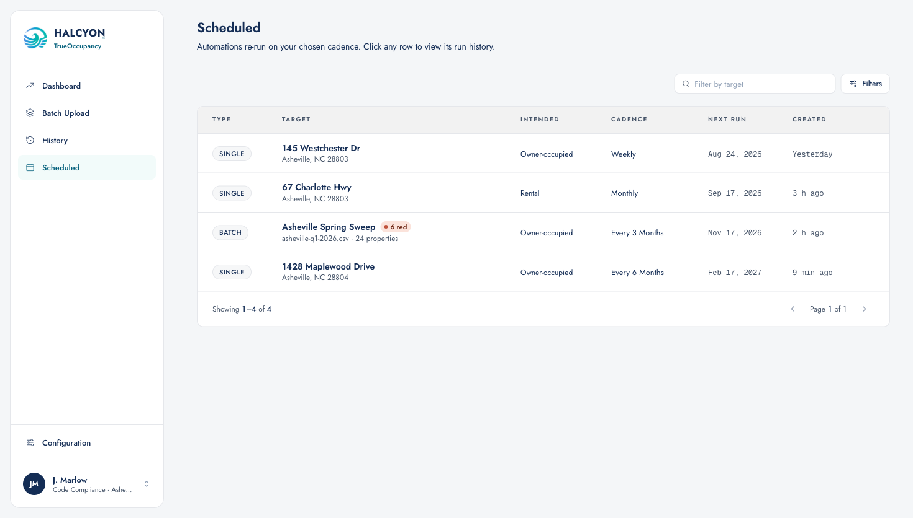
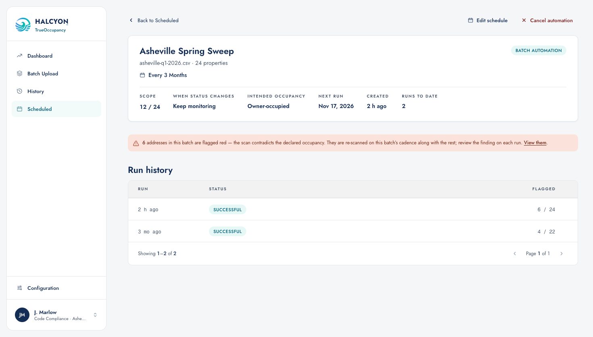

*Run history — per-run Intended on both timeline kinds:*
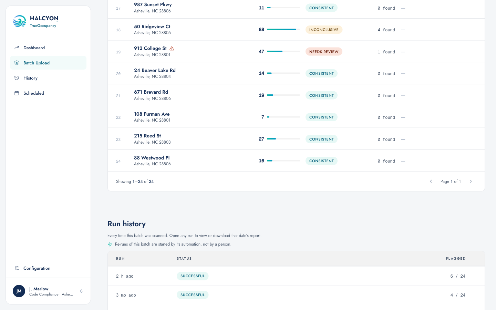

Production notes: the "Mixed" hover uses a native `title` in the prototype — production should use the `InfoHover` extension once signed off. CSV junk-intent intake notice (#37 edge case) is **not** in the prototype; build from the card.
- #35/#36 are **one change** — the shared `buildScanColumns` (`HomeScreen.tsx:208`) feeds both Dashboard and History.
- #37 promotes the per-address Declared column from the red-filtered set (`buildBatchRedColumns`) into the default batch columns — don't duplicate it in the red view. CSV junk intents (`normalizeIntent` returns null) must surface an intake notice, not a silent fallback.
- #38/#39: schedules list + batch-schedule detail show the batch summary ("Mixed"), per-address on the opened run.
- #48: per-run intent on `RunHistory` rows (both kinds), from the same helper.

### W3 — Confidence flip
**Closes:** #40 #41 · **Independent** · **✅ fully implemented in the prototype**
`ConfidenceHero.tsx` (flip + finding-labelled copy, metric labelled **"Confidence"**) and `CertificateSheet.tsx` (main finding + per-row history — each row flips on **its own** verdict). Port verbatim. Nomenclature: the metric is **"Confidence"** — *not* "Rental Confidence", which the flip makes contradictory on not-rented (`6244459`). **Exception — declared "Not sure", any toggle state** (`c38aabf`, `c0ca409`, `fa57634`, `7495125`): "Not sure" remains Not sure everywhere — the #42 resolve choice drives triage colours only. The number stays the **raw** rented-probability labelled **"Rental Confidence"** ("12% — unlikely a rental"); the **headline keeps the reconciliation vocabulary** (Consistent / Inconclusive / Needs review, same as the tables); the why-line names the finding and the org's Not-sure handling. Do **not** flip: `RedPropertyDrawer:212` (always the rented branch), `ListingsPanel` Confidence (listing-match, different number), `AIInvestigator` scores.

**Before:** a not-rented result showed the raw rented-probability — `12% confidence` — under a "Consistent"/"Not Rented" headline, reading as if we were unsure. **After (built):**

*Hero — "88% confident this property is not rented", with the Declared line intact:*
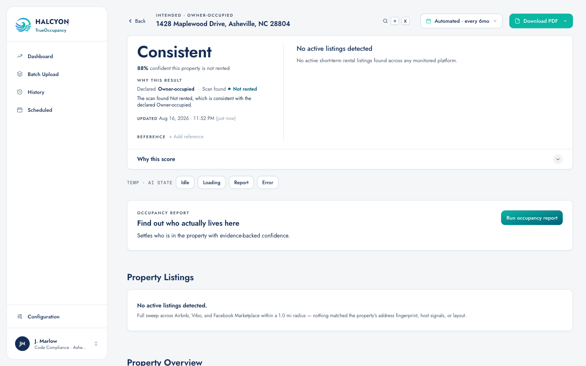

*PDF certificate — same rule, same figure ("Not Rented · 88% confidence"), screen and PDF can never disagree:*
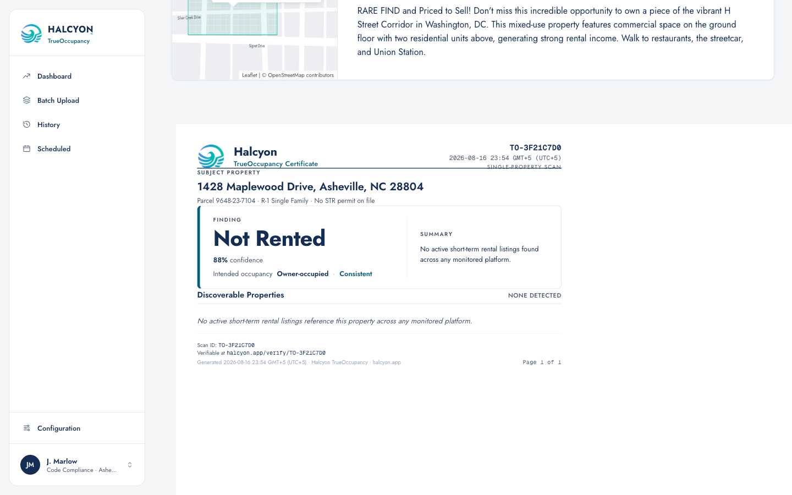

### W4 — "Not sure" config
**Closes:** #42 · **Independent** · **✅ implemented in the prototype (`dd679a2`)**
**Decision (Aug 17): "Not sure" resolves to a real occupancy type — it has no outcomes of its own.** The Not-sure matrix row loses its three colour selectors and gains a **toggle**: OFF (default) silently scores it as **Owner-occupied**, and the row's cells render **neutral (—)** (the fallback is never surfaced as colours/copy); ON reveals a **"Treat 'Not sure' as"** selector (Owner-occupied / Second home / Rental / investment) that drives the pills and all scoring. New `OccConfig` fields `notSureResolve` / `notSureResolveAs`. A single `effectiveOutcomeIntent()` resolves `not-sure` for **both** the config matrix (`occMatchForRisk`/`deriveOccStatus`) and the legacy `reconcileOccupancy` (BatchScreen), so Dashboard, History, batch reds, result pages and the PDF all agree — an undeclared property reconciles exactly like the resolved type (it CAN be "Needs review"). Scan-intake copy updated accordingly.

### W5 — AI report core
**Closes:** #46 → #43 #44 · #46 ✅ in prototype (`dc0f0af`). (#45 per-lender trigger was **removed** — `8dbf53e`.)
- #46: one opt-in toggle, OFF by default, copy states **single + batch** coverage and the **cost** reason. On: red from a single scan auto-runs the report; a batch finds its red rows and runs them.
- #45: **removed.** The per-lender "matched listing → dig deeper / flag and stop" trigger was dropped (`8dbf53e`); the AI-report section is now just the auto-run toggle.
- #43: batch job over `LiveBatch.aiPhase` / per-row `aiReport` (state machine already in `AppState.tsx` — the sim conveyor is the seam a real backend replaces). Per-row retry for failures; notification-dock "AI reports · N of M" states need speccing.
- #44: run-now must bypass the batch queue; add a cost hint at the CTA.
- AI-report **scheduling stays deferred** (human-in-the-loop, per scope).

**Before:** no AI settings existed anywhere in Config. **After (built) — the #46 toggle, OFF by default, with the single+batch+cost copy:**

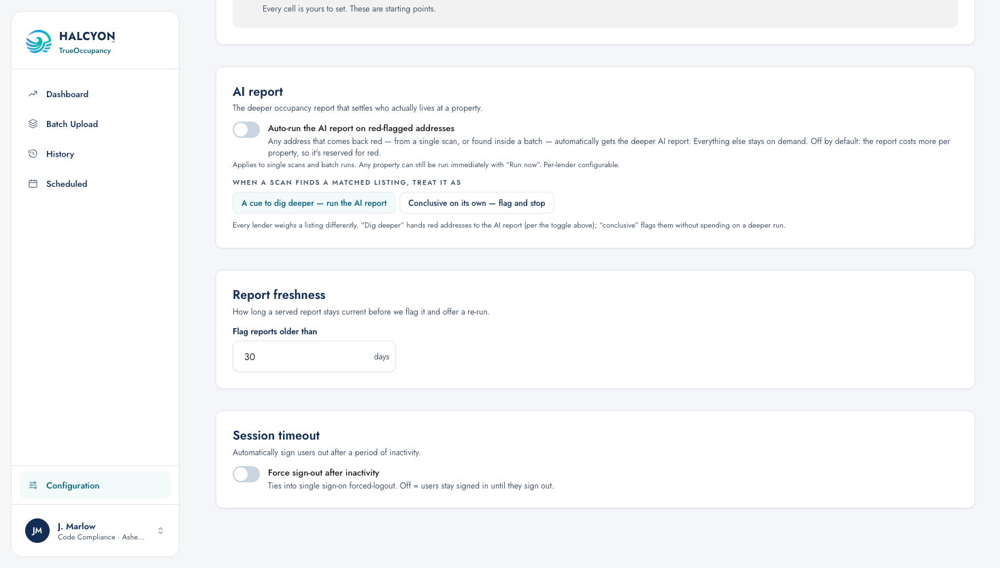

*The existing on-demand AI slot on the result page (#44's starting point — "Run occupancy report"):*
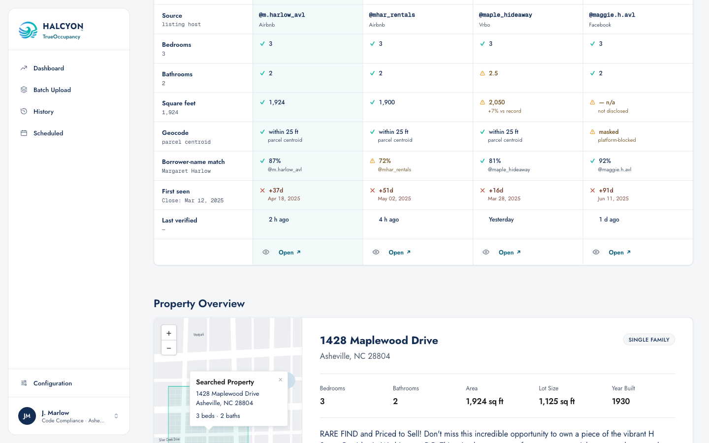

### W6 — Provenance & AI visibility
**Closes:** #47 #49 #50 · **Depends on:** W5 · #49 + #50 ✅ in prototype (`1b3f477`)
- #47: cached serve + "last ran / last confirmed" + "re-checked on X — identical result". Applies to the **transparency certificate** only; the AI-report PDF is deferred scope. *(Not yet mocked.)*
- #49: ✅ "AI report" column on schedule-detail run rows — Done / Failed / Running pills, nothing when a run never triggered AI. Demo: `#/scheduled/s02` (one Done, one Failed run).
- #50: ✅ quiet "AI" Pill beside the verdict/status pill on rows whose latest run has a stored report — Dashboard + History in the prototype; extend to Batch/Scheduled cells with the same one-liner. Strictly informational.

*Today's provenance surface — the UPDATED stamp under the hero that #47 extends into "last ran / last confirmed / re-checked, identical":*
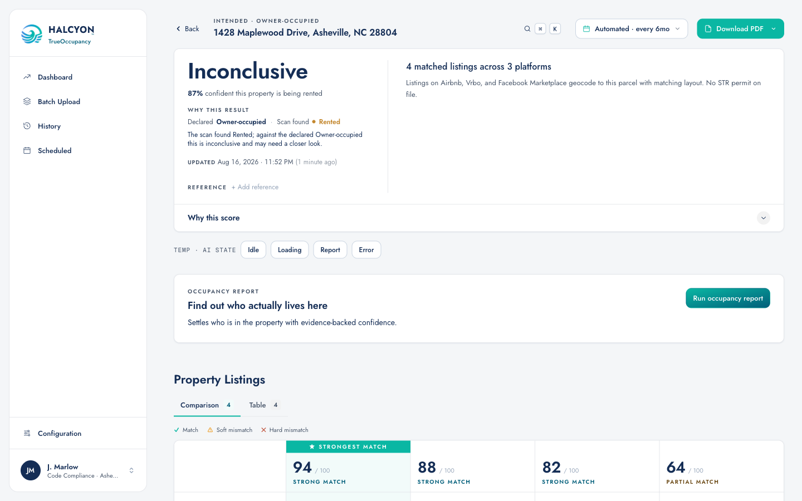

### W7 — Status-change reaction *(cross-cutting)*
**Closes:** #52 · **Depends on:** W5
Source-agnostic rule: any effective-status change (re-scan or AI) re-evaluates automation membership via the **existing** `retention: monitor | remove`; a cleared red stops its red-flag-rule automation (existing stopped/restart UI in the red drawer). **Scope guard:** whether AI changes the effective status is the Aug-13 open question — this workstream triggers on status change from any source and does not itself decide that.

### W8 — Red-list retirement *(debt)*
**Closes:** #51 · **Independent** · **✅ implemented in the prototype**
`HomeScreen` ⚠ flags + batch "N red" badge and `ScheduleDetailScreen` red-count banner are now matrix-derived (`occMatchForRisk`). Production: port, then **delete `isRedAddress`** (`RedAddressesScreen.tsx:250`). Headline regression: same address, same run → same red status on every screen; no row with a red ⚠ and a non-red pill. (The dashboard/schedule-detail shots under W2 above show the affected ⚠/badge/banner surfaces.)

### W9 — Config banner copy *(pre-existing card, already done)*
**Closes:** [#32](https://trello.com/c/ZRH4dYGi) · **✅ on `main` — commit `49f95f0`**
`ScanConfigScreen.tsx` sticky footer: the stale scoring-detail line replaced with a plain "Do you want to keep the changes?" prompt (+1/−9). Nothing left to build — verify against the card and move it to Ready for Test.

---

## Suggested build order

```
PR 0  W9           (#32 — already on main at 49f95f0; verify + move to Ready for Test)
PR 1  W1 + W8      (helper + debt port — small, unblocks everything)
PR 2  W2           (all Intended columns in one PR — shared builder means split PRs drift)
PR 3  W3           (hero + PDF together; never ship one without the other)
PR 4  W4           (trivial — just confirm "Not sure" is a plain matrix row)
PR 5  W5           (#46 first — the toggle is the contract #43/#44 implement)
PR 6  W6           (needs PR 5)
PR 7  W7           (needs PR 5)
```

## Cross-cutting regression checklist
- [ ] Declared value for one address identical on Dashboard, History, Batch, Scheduled, run history, PDF.
- [ ] "Mixed" appears iff a batch's resolved intents differ; counts on hover sum to the batch total.
- [ ] Confidence % + finding label agree with the verdict pill on every surface; screen and PDF show the same figure; metric labelled "Confidence".
- [ ] "Not sure" row: toggle OFF → neutral (—) cells + silent Owner-occupied scoring; ON → the three-type selector drives pills and scoring; undeclared reconciles like the resolved type everywhere.
- [ ] AI auto-run fires only on red, only when opted in; yellow/green stay on-demand; run-now always works.
- [ ] A status change (any source) re-evaluates automation membership; cleared red = stopped rule, visible in the drawer.
- [ ] `isRedAddress` deleted; grep clean; editing the outcome matrix moves every ⚠/count on next read.

## Not in this release (decided or deferred — do not build)
- AI-report certificate/PDF and AI-report scheduling (deferred, July-23 scope).
- AI changing the displayed verdict / "changed by AI" icons / investigation-level indicator (Aug-13 open question — parked proposal).
- Deep search on yellow/green (works against the scaled-cost model).
- Outside pictures / image matching (research only, no UI expected).

**Reading order for day 1:** `src/state/OccupancyConfig.tsx` → `src/state/AppState.tsx` (resolver seams, `aiPhase` conveyor, `retention`) → `src/pages/ScanConfigScreen.tsx` (Not-sure + AI toggle mocks) → `src/components/result/ConfidenceHero.tsx` + `CertificateSheet.tsx` (the flip) → `src/pages/HomeScreen.tsx` (`buildScanColumns`, matrix-derived ⚠).
